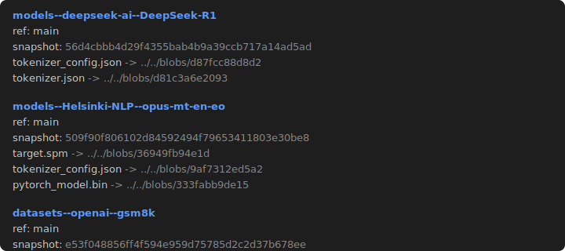

# hf-cache-dirs

Inspect your local Hugging Face cache (`~/.cache/huggingface/hub`).

Lists all cached repos (models, datasets, spaces) with their refs, snapshots, and files. **Folder names are clickable hyperlinks to the corresponding Hugging Face page.**

## Sample output



## Build

```bash
make
```

Requires a C++17 compiler and OpenSSL (for `download`).

## Usage

### Inspect cache

```bash
# List cached repos
./hf-cache-dirs

# Create a "hub" symlink in the current directory
./hf-cache-dirs --link

# Remove it
./hf-cache-dirs --unlink
```

### Download files from the Hub

```bash
# Download a single file
./download google/flan-t5-base config.json

# Download a large model file
./download unsloth/Qwen3.5-9B-GGUF Qwen3.5-9B-UD-Q4_K_XL.gguf

# With options
./download <repo_id> <filename> --revision v1.0 --repo-type dataset --token hf_xxx --force
```

Files are stored in the standard HF cache layout (`blobs/`, `snapshots/`, `refs/`), fully compatible with the Python `huggingface_hub` library. Supports resume on interrupted downloads.

Set `HF_TOKEN` env var or pass `--token` for private/gated repos.

## Format

```bash
make format
```

Uses [clang-format](https://clang.llvm.org/docs/ClangFormat.html) with a config based on llama.cpp's style.
